# Introduction

CONCLUS is a tool for robust clustering and positive marker features selection of 
single-cell RNA-seq (sc-RNA-seq) datasets. Of note, CONCLUS does not cover the 
preprocessing steps of sequencing files obtained following next-generation 
sequencing. You can find a good resource to start with 
[here](https://scrnaseq-course.cog.sanger.ac.uk/website/index.html). 

CONCLUS is organized into the following steps:

  + Generation of multiple t-SNE plots with a range of parameters including 
    different selection of genes extracted from PCA.
  + Use the Density-based spatial clustering of applications with noise (DBSCAN)
    algorithm for idenfication of clusters in each generated t-SNE plot.
  + All DBSCAN results are combined into a cell similarity matrix.
  + The cell similarity matrix is used to define "CONSENSUS" clusters conserved
    accross the previously defined clustering solutions.
  + Identify marker genes for each concensus cluster.
  

# Getting help

Issues can be submitted directly on github: https://github.com/lancrinlab/CONCLUS/issues. To contact us directly write to christophe.lancrin@embl.it. This package was developed by Polina Pavlovich who is now doing
her Ph.D at the Max Planck Institute of Immunobiology and Epigenetics.


# Standard workflow

## Installation

```{r loading_conclus, results="hide", warning = FALSE, message = FALSE}
# required R >= 3.4.
if(!requireNamespace("devtools"))
	install.packages("devtools")

if(!requireNamespace("BiocManager"))
	install.packages("BiocManager")

library(devtools)
library(BiocManager)

if(!requireNamespace("conclus"))
	install_github("lancrinlab/CONCLUS", dependencies = TRUE)
```

If you get a message such as: *packages ‘BiocParallel’, ‘scran’, ‘scater’, ‘monocle’, ‘SingleCellExperiment’, ‘KEGGREST’, ‘AnnotationDbi’, ‘biomaRt’, ‘org.Mm.eg.db’, ‘S4Vectors’, ‘Biobase’ are not available (for R version 3.6.0)*,
please run the following commands:

```{r, eval = FALSE}
install(c("BiocParallel", "scran", "scater", "monocle", "SingleCellExperiment", 
"KEGGREST", "AnnotationDbi", "biomaRt", "org.Mm.eg.db", "S4Vectors", "Biobase"))
install_github("lancrinlab/CONCLUS", dependencies = TRUE)
```


## Quick start

CONCLUS requires to start with a raw-count matrix with reads or unique molecular 
identifiers (UMIs). The columns of the count matrix must contain cells and the 
rows -- genes. CONCLUS needs a large number of cells to collect statistics, 
we recommend using CONCLUS if you have at least 100 cells.

```{r runConclus_first, results='hide', warning = FALSE, fig.keep = 'none', message= FALSE}
library(conclus)

## Replace by the path to the directory in which results should be written
outputDirectory <- "./YourOutputDirectory"
experimentName <- "Bergiers"

countMatrix <- read.delim(file.path(system.file("extdata", package = "conclus"),		
                                    "Bergiers_counts_matrix_filtered.tsv"), 
                          stringsAsFactors = FALSE)
columnsMetaData <- read.delim(file.path(system.file("extdata", package = "conclus"), 
                                "Bergiers_colData_filtered.tsv"))

sceObjectCONCLUS <- runCONCLUS(outputDirectory, 
                               experimentName,
                               columnsMetaData,
		                       species = "mmu", 
                               plotPDFcellSim = TRUE, # FALSE for > 2500 cells
                               k = 10, cores = 1,
                               statePalette = c("bisque", "cadetblue2", 
                                                "coral1", "cornflowerblue"),
                               deleteOutliers = FALSE)
                               
exportClusteringResults(sceObjectCONCLUS, outputDirectory, experimentName, 
                        "clusters_table.tsv")
```

Five folders will appear in your "outputDirectory": 

  + *output_tables*:
  
    - _cellsSimilarityMatrix.csv: Similarity matrix used to define the consensus clusters using every cells.
    - _clustersSimilarityMatrix.csv: Simplified similarity matrix with median averaged cell values per cluster.
    - _clusters_table.tsv: Cell-cluster corresponding table for defined consensus clusters.
    - _dbscan_results.tsv: Cell-cluster corresponding table for each db-scan parameter.
    - _tSNEResults.rds: Saved RDS object containing a matrix of all t-SNE results (for different PCs and perplexities, see below).  
  
  + *pictures*: This folder contains two similarity matrices clustering heatmaps. One using all cells and the other median averaged by cluster.
                It also contains a subfolder "tSNE_pictures" containing all tSNEs generated with different PCs and perplexity parameters,
                and colored by condition, by cluster found, by dbscan, or uncolored (see below for details).
  + *marker_genes*: This folder contains a list of marker genes, ordered by decreasing score, for each consensus cluster.
  + *tsnes*: Folder containing, for each PCs/complexity values, the tSNE coordinates of each cell.

Further details about how all results are generated can be found below.


## Data

In this vignette, we demonstrate how to use CONCLUS on a sc-RNA-seq dataset from 
[*Bergiers et al. eLife 2018*](https://elifesciences.org/articles/29312). The design for this experiment is described in 
([*Figure 4—figure supplement 2*](https://elifesciences.org/articles/29312/figures#fig4s2)). Bergiers et al. goal was to analyze 
the effect of the simultaneous expression of eight transcription factors (8TFs): *Runx1* - and its partner - *Cbfb*, *Gata2*, 
*Tal1*, *Fli1*, *Lyl1*, *Erg* and *Lmo2* in *in vitro* differentiated embryonic stem cells (ESCs) in comparison to control. 
They knocked-in a polycistronic transgenic construct allowing to over-express eigth transcription factors (i8TFs) simultaneously 
after adding doxycycline (dox). The Empty ESC line did not have any transgene. 
There were **four conditions**: E_minus (Empty no dox), E_plus (Empty with dox), i8TFs_minus (i8TFs no dox) and i8TFs_plus 
(i8TFs with dox). 

This sc-RNA-seq experiment was performed using the SMARTer ICELL8 Single-Cell System ([Click here for more info](https://www.takarabio.com/learning-centers/automation-systems/icell8-introduction/icell8-technology-overview)). The protocol was based on 3' end RNA 
sequencing where each mRNA molecule is labeled with a unique molecular identifier (UMI) during reverse transcription in every 
single cell. The analysis performed by *Bergiers et al.* was based on the dimensionality reduction algorithm called Principal 
Component Analysis (PCA), and they found that there was a major gene expression difference between i8TFs_plus and the other three 
conditions (*Figure 4—figure supplement 2*). **However, it was not clear if other subclusters could be identified consistently in 
this dataset besides the two major clusters. In the current tutorial, we show how CONCLUS can help us to answer this question.**

Labels of the four conditions are in the *state* column of *columnsMetaData*. To avoid a bias in the clustering analysis due to the 
high expression of the eight transcription factors construct, we deleted genes *Cbfb*, *Gata2*, *Tal1*, *Fli1*, *Lyl1*, *Erg*, and *Lmo2* 
from the provided *countMatrix*. Highly abundant embryonic hemoglobins with names starting with "Hba" or "Hbb" were also excluded because 
they seemed to be a primary source of contamination.


## Test clustering

The *TestClustering* function runs one clustering round out of the 84 (default) rounds that CONCLUS normally performs. This step can be useful to determine if the default DBSCAN parameters are suitable for your dataset. 
By default, they are *dbscanEpsilon = c(1.3, 1.4, 1.5)* and *minPts = c(3,4)*. If the dashed horizontal line in the k-NN distance plot lays on the “knee” of the curve (as shown below), it means that optimal epsilon is equal
to the intersection of the line to the y-axis. In our example, optimal epsilon is 1.4 for 5-NN distance where 5 corresponds to MinPts. 

In the "test_clustering" folder under outputDirectory, the three plots below will be saved where one corresponds to the “distance_graph.pdf” (Figure1), another one to “test_tSNE.pdf” (*p[[1]]*, Figure2), and the last one will be saved as 
“test_clustering.pdf” (*p[[3]]*, Figure3).


```{r normalization_1, results="hide", warning = FALSE}
sceObject <- conclus::normaliseCountMatrix(countMatrix, species = "mmu", 
                                  colData = columnsMetaData)
```


```{r testClustering, fig.height=5, fig.width=6, fig.keep = 'none'}
p <- conclus::testClustering(sceObject, outputDirectory, experimentName)
```

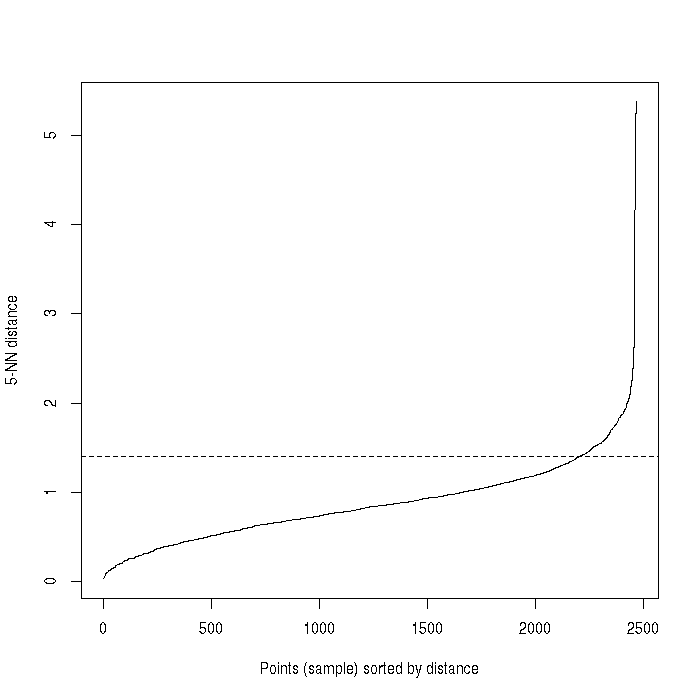

```{r testClustering_result1, eval = FALSE}
# saved as "outputDirectory/test_clustering/test_tSNE.pdf"
p[[1]]
```

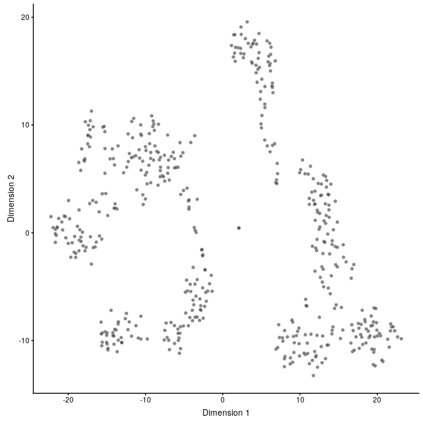

```{r testClustering_result2, eval = FALSE}
# saved as "outputDirectory/test_clustering/test_clustering.pdf"
p[[3]]
```

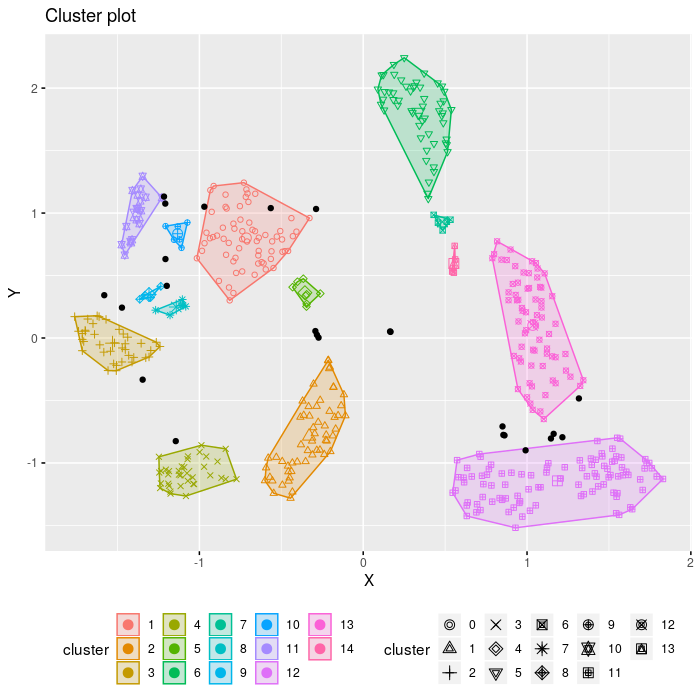

# CONCLUS step by step

The wrapper function runCONCLUS is organized into 7 steps:

  + Normalization of the counts matrix
  + Generation of t-SNE coordinates
  + Clustering with DB-SCAN
  + Cell and cluster similarity matrix calculation
  + Plotting
  + Results export
  + Marker genes identification


## Normalization of the counts matrix

sc-RNA-seq datasets are quite challenging notably because of sparsity (many genes are not detected consistently yielding expression matrices with many zeroes) and also because of technical noise. 
To facilitate analysis, one needs to perform a step of normalization which allows the correction of unwanted technical and biological noises (click [here](https://www.ncbi.nlm.nih.gov/pmc/articles/PMC5549838/) for a complete review on
normalization techniques).

CONCLUS uses Scran and Scater packages for normalization. Beforehand, the function will annotate genes creating *rowData* and add statistics about cells into *columnsMetaData*. If you already have *columnsMetaData* and *rowData*, 
you can give it to the function (see manual). It will keep your columns and add new ones at the end. If you do not want to lose any cell after quality metrics check, select *alreadyCellFiltered = TRUE*, by default it is *FALSE*. 
Before *scran* and *scater* normalization, the function will call *scran::quickCluster* (see manual for details). If you want to skip this step, type *runQuickCluster = FALSE*, by default it is *TRUE*. 
We recommend to use *runQuickCluster = TRUE* for medium-size datasets with 500-10000 cells. However, it can take a significant amount of time for a larger amount of cells and will not be useful for small sets of 200-300 samples. 

This function is currently limited to human and mouse.
\newline
```{r normalization_2, results="hide", warning = FALSE, message = FALSE}
sceObject <- conclus::normaliseCountMatrix(countMatrix, species = "mmu", 
                                  colData = columnsMetaData)
```

The function *normaliseCountMatrix* returns a *sceObject* with slots *counts*, *exprs*, *colData*, and *rowData*. *rowData* keeps information about GO terms containing genes on the cell surface or involved in secretion. 
This information can help to study cross-talk between cell types or find surface protein-coding marker genes suitable for flow cytometry. The columns with the GO terms are *go_id* and *name_1006* (see manual).

The slots can be accessed as indicated below:
\newline
```{r normalization_results}
# checking what changed after the normalisation
dim(sceObject)

# show first columns and rows of the count matrix
SingleCellExperiment::counts(sceObject)[1:5,1:5]

# show first columns and rows of the normalized count matrix
Biobase::exprs(sceObject)[1:5,1:5]

# visualize first rows of metadata (coldata)
coldataSCE <- as.data.frame(SummarizedExperiment::colData(sceObject))
head(coldataSCE)

# visualize beginning of the rowdata containing gene information
rowdataSCE <- as.data.frame(SummarizedExperiment:::rowData(sceObject))
head(rowdataSCE)
```


## Generation of t-SNE coordinates

*runCONCLUS* creates needed output folders (if you did not run *testClustering* beforehand). Then it generates an object of fourteen (by default) tables with tSNE coordinates. Fourteen because it will vary seven values of 
principal components *PCs=c(4, 6, 8, 10, 20, 40, 50)* and two values of perplexity *perplexities=c(30, 40)* in all possible combinations. 

The chosen values of PCs and perplexities can be changed if necessary. We found that this combination works well for sc-RNA-seq datasets with 400-2000 cells. If you have 4000-9000 cells and expect more than 15 clusters, 
we recommend to use more first PCs and higher perplexity, for example, *PCs=c(8, 10, 20, 40, 50, 80, 100)* and *perplexities=c(200, 240)*. For details about perplexities parameter see ‘?Rtsne’.
\newline
```{r tsne_generation, results="hide", warning = FALSE}
initialisePath(outputDirectory)
# default parameters, can be selected by a user
PCs=c(4, 6, 8, 10, 20, 40, 50)
perplexities=c(30, 40)
randomSeed = 42
tSNEResults <- generateTSNECoordinates(sceObject, outputDirectory, 
                                          experimentName, PCs=PCs, 
                                          perplexities=perplexities,
                                          randomSeed = randomSeed)
```

Results can be explored as follows:
\newline
```{r tsne_showResults}
ncol(tSNEResults)
# the third matrix of t-SNE coordinates with PC = 8 and perplixities = 30
# it is saved as "tsnes/Bergiers_tsne_coordinates_3_8PCs_30perp.tsv"
head(tSNEResults[1,3][[1]])
```


## Clustering with DB-SCAN

Following the calculation of t-SNE coordinates, DBSCAN is run with a range of epsilon and MinPoints values which will yield a total of 84 clustering solutions (PCs x perplexities x MinPoints x epsilon). *minPoints* is the minimum 
cluster size which you assume to be meaningful for your experiment and *epsilon* is the radius around the cell where the algorithm will try to find *minPoints* dots. Optimal *epsilon* must lay on the knee of the k-NN function as 
shown in the "test_clustering/distance_graph.pdf" (See Test clustering section above). 
\newline
```{r runDBSScan, results="hide", warning = FALSE}
epsilon=c(1.3, 1.4, 1.5)
minPoints=c(3, 4)
cores=1
dbscanResults <- conclus::runDBSCAN(tSNEResults, sceObject, outputDirectory, 
                           experimentName, epsilon=epsilon, 
                           minPoints=minPoints,
                           cores=cores)
```


## Cell and cluster similarity matrix calculation

The above calculated results are combined together in a matrix called “cell similarity matrix”. *RunDBSCAN* function returns a matrix where columns are cells and rows are 84 clustering solutions (which is equal to number of 
PCs x perplexities x MinPoints x epsilon). Since the range of cluster varies from result to result, there is no exact match between numbers in different rows of the returned matrix. Cells having the same number within a row are 
guaranteed to be in one cluster. We can calculate how many times out of 84 clustering solutions, every two cells were in one cluster and that is how we come to the similarity matrix of cells. We want to underline that zero in the 
*dbscanResults* means that a cell was not assigned to any cluster, so two cells with zeros were not necessarily similar, that is why we count clusters starting from one. *clusterCellsInternal* is a general function which returns a 
*sceObject* with new clusters and calculated *cellsSimilarityMatrix*. 
\newline
```{r clusterCellsInternal, results="hide", warning = FALSE}
clusteringMethod="ward.D2"
k=10 # parameter for cutree
deepSplit = 0 # 0 to avoid cutreeDynamic, 1 to 4 to use it
message("Calculating cells similarity matrix.")
clusteringResults <- conclus::clusterCellsInternal(dbscanResults, sceObject, clusterNumber=k, 
                                  deepSplit=deepSplit, cores=cores,
                                  clusteringMethod=clusteringMethod)
sceObjectFiltered <- clusteringResults[[1]]
cellsSimilarityMatrix <- clusteringResults[[2]]
```
```{r clusterCellsInternal_showResults}
print(table(SummarizedExperiment::colData(sceObjectFiltered)$clusters, 
              dnn=list("Cells distribuion by clusters")))
```

After looking at the similarity between elements on the single-cell level, which is useful if we want to understand if there is any substructure which we did not highlight with our clustering, a "bulk" level where we pool all cells 
from a cluster into a representative "pseudo cell" can also be generated. This gives a *clusterSimilarityMatrix*:
\newline
```{r clustersSimilarityMatrix}
clustersSimilarityMatrix <- 
      conclus::calculateClustersSimilarity(cellsSimilarityMatrix, 
          sceObject = sceObjectFiltered,
          clusteringMethod = "ward.D2")[[1]]
```


## Plotting


### t-SNE colored by clusters or conditions

CONCLUS generated 14 tSNE combining different values of PCs and perplexities. Each tSNE can be visualized either using coloring reflecting the results of DBScan clustering, the conditions or without colors. Here *plotClusteredTSNE*
is used to generate all these possibilities of visualization. 
\newline
```{r plotClustered}
tSNEclusters <- conclus::plotClusteredTSNE(sceObjectFiltered, outputDirectory, 
                experimentName, PCs=PCs, perplexities=perplexities, 
                colorPalette = "default", columnName = "clusters", 
                returnPlot = TRUE)
                
tSNEnoColor <- conclus::plotClusteredTSNE(sceObjectFiltered, outputDirectory, 
                experimentName, PCs=PCs, perplexities=perplexities, 
                colorPalette = "default", columnName = "noColor", 
                returnPlot = TRUE)
                
if(any(colnames(SummarizedExperiment::colData(sceObjectFiltered)) 
   %in% "state")){
  tSNEstate <- conclus::plotClusteredTSNE(sceObjectFiltered, outputDirectory, 
               experimentName, PCs=PCs, perplexities=perplexities, 
               colorPalette = "default", columnName = "state", 
               returnPlot = TRUE)
}
```

For visualizing the 5th (on 14) tSNE cluster (figure 4):
\newline
```{r plotClustered_visualization1, eval = FALSE}
tSNEclusters[[5]]
```

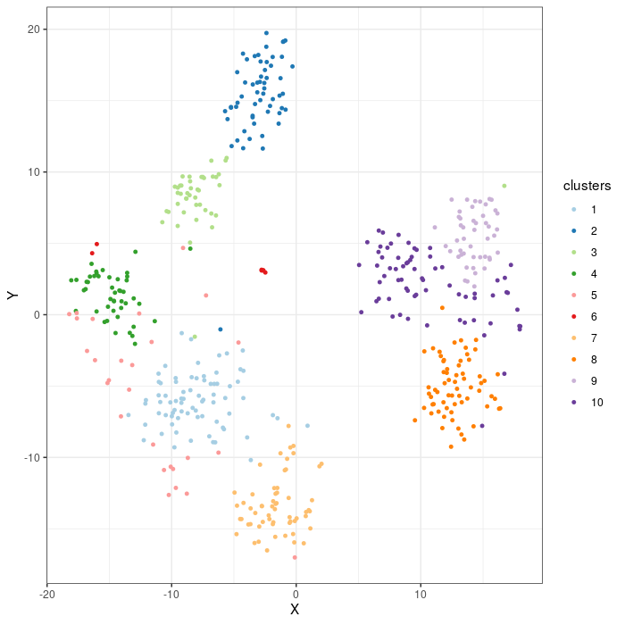


For visualizing the 5th (on 14) tSNE cluster without colors (figure 5):
\newline
```{r plotClustered_visualization2, eval = FALSE}
tSNEnoColor[[5]]
```

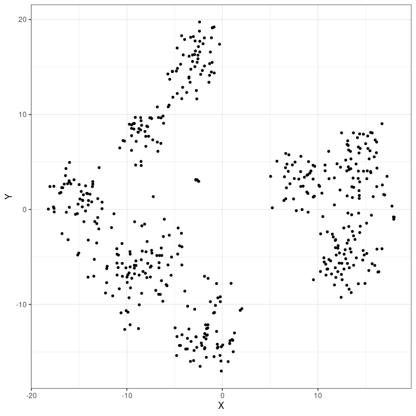


For visualizing the 5th (on 14) tSNE cluster colored by state (figure 6):
\newline
```{r plotClustered_visualization3, eval = FALSE}
tSNEstate[[5]]
```

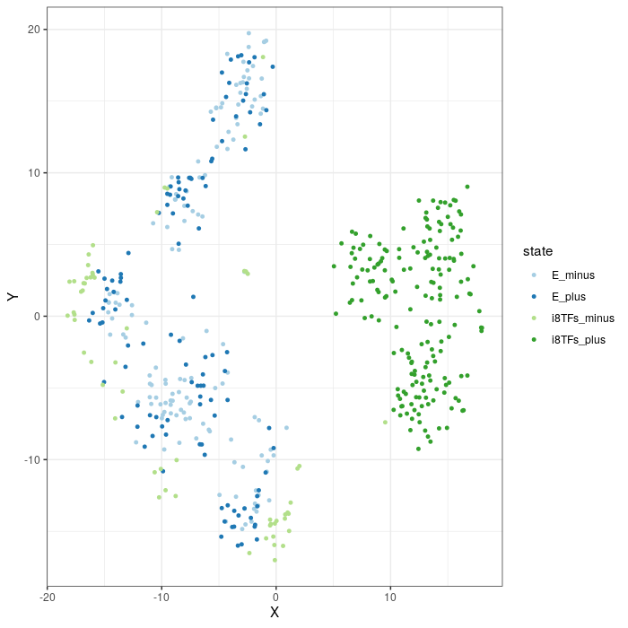


### Cell similarity heatmap

The *cellsSimilarityMatrix* is then used to generate a heatmap (Figure 7) summarizing the results of the clustering and to show how stable the cell clusters are accross the 84 solutions.
\newline
```{r plotCellSimilarity, warning = FALSE, fig.keep = 'none'}
colorPalette="default"
statePalette="default"
plotPDFcellSim = TRUE
orderClusters = FALSE
clustersNumber <- length(unique(
                     SummarizedExperiment::colData(sceObjectFiltered)$clusters))
colorPalette <- conclus::choosePalette(colorPalette, clustersNumber)

# Plotting stability of clusters
conclus::plotCellSimilarity(sceObjectFiltered, cellsSimilarityMatrix, outputDirectory,
                 experimentName, colorPalette, 
                 orderClusters = orderClusters, 
                 statePalette = statePalette, 
                 clusteringMethod = clusteringMethod,
                 plotPDF = plotPDFcellSim,
                 returnPlot = TRUE)
```

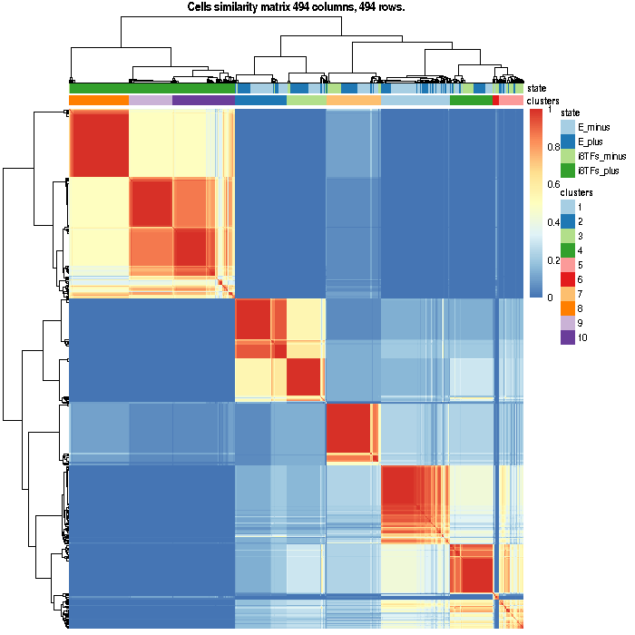

*CellsSimilarityMatrix* is symmetrical and its size proportional of to the "number of cells x number of cells". Each vertical or horizontal tiny strip is a cell. Intersection shows the proportion of clustering iterations in which a 
pair of cells were in one cluster (score between 0 and 1, between blue and red). We will call this combination "consensus clusters" and use them everywhere later. We can appreciate that cellsSimilarityMatrix is the first evidence 
showing that CONCLUS managed not only to distinguish i8TFs_plus cells from the three other groups (as in the original publication) but also find subpopulations within these groups which were impossible using PCA alone.

### Cluster similarity heatmap

```{r plotClustersSimilarity, warning = FALSE, message = FALSE, eval = FALSE}  
conclus::plotClustersSimilarity(clustersSimilarityMatrix, 
                       sceObjectFiltered,
                       dataDirectory = outputDirectory, 
                       experimentName = experimentName, 
                       colorPalette = colorPalette,
                       statePalette = statePalette,
                       clusteringMethod = clusteringMethod,
                       returnPlot = TRUE)
```

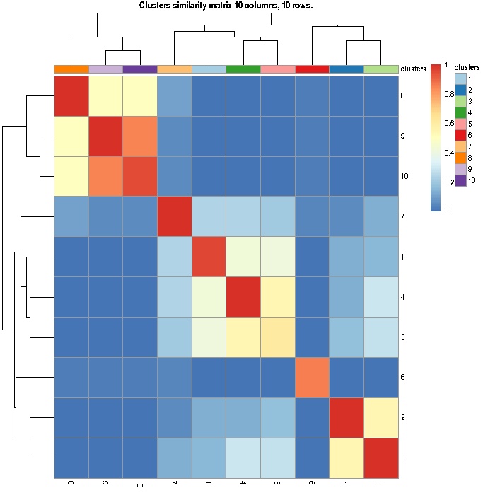

In the *clusterSimilarityMatrix*, we can still see two major families of clusters: clusters with 8, 9, and 10 on one side and 1, 2, 3, 4, 5, 6 and 7, on the other. Almost all clusters have a high value of similarity across all clustering 
solutions. Only clusters 5-6 have a quite low similarity value. Red color on the diagonal means that the group is homogenous, and usually, it is what we want to get. The yellow on the diagonal indicates that either 
that group consists of two or more equal sized subgroups. Bluish color points to a cluster of dbscan "outliers" that usually surrounds dense clouds of cells in t-SNE plots. 


## Results export

  *runCONCLUS* is saving *cellsSimilarityMatrix* and *clustersSimilarityMatrix* to the subfolder *output_tables*.
\newline
```{r exportMatrix}
conclus::exportMatrix(cellsSimilarityMatrix, outputDirectory, experimentName, 
           "cellsSimilarityMatrix")
conclus::exportMatrix(clustersSimilarityMatrix, outputDirectory, experimentName, 
           "clustersSimilarityMatrix")
```
  The exportData function enables to save the normalized expression matrix, columns and row data as the full workspace to the *output_tables* subfolder.
\newline  
```{r exportData}
conclus::exportData(sceObjectFiltered, outputDirectory, experimentName)
```

Finally, as seen in the runCONCLUS section, the conclus::exportClusteringResults() function enables to export all results.


## Marker genes identification

To understand the nature of the consensus clusters identified by CONCLUS, it is essential to identify genes which could be classified as marker genes for each cluster. To this aim, each gene should be "associated" to a particular 
cluster. This association is performed by looking at upregulated genes in a particular cluster compared to the others (multiple comparisons). The function *rankGenes* performs multiple comparisons of all genes from the 
sceObjectFiltered and rank them according to a score reflecting a FDR power. It saves one file per cluster in the folder *marker_genes*.

In summary, the function *conclus::rankGenes()* gives a list of marker genes for each cluster, ordered by their significance. See ?conclus::rankGenes for more details.   
\newline
```{r rankGenes, message = FALSE}
conclus::rankGenes(sceObjectFiltered, clustersSimilarityMatrix, outputDirectory, 
            experimentName)
rankedGenesClus5 <- read.delim(file.path(outputDirectory, "marker_genes",
                               "Bergiers_cluster_5_genes.tsv"),
                               stringsAsFactors = FALSE)
```

```{r rankGenes_result}
head(rankedGenesClus5, n = 10)
```

# Plot a heatmap with positive marker genes

To understand the nature of the consensus clusters identified by CONCLUS, it is essential to identify genes, which could be classified as marker genes for each cluster. Following the execution of the runCONCLUS function, a folder 
called “marker_genes” is automatically generated in your dataDirectory. It contains one Tab Separated Values (tsv) file for each cluster. Each tsv file contains a list of genes ranked according to how high these genes are expressed 
in a given cluster in comparison to all the other clusters.

CONCLUS offers the option to visualize the marker genes on a heatmap (Figure 9). Below we chose to select 10 marker genes per cluster which should generate a heatmap with 100 genes (10 marker genes x 10 clusters) which is convenient for 
visualization. In practice, the number of genes in this heatmap will be less than 100 because some genes have been classified as markers for more than one cluster. This can happen when several clusters correspond to similar cellular 
types. In this particular example, we have a list of 88 genes.

We ask the function *plotCellHeatmap* to order clusters and genes by similarity (the same order as in the *clusterSimilarityMatrix*) and show mean-centered normalized data. Mean-centering allows seeing the relative expression of a 
gene compared to the mean.
\newline
```{r plotCellHeatmap_marker1, warning=FALSE, fig.keep = 'none'}
genesNumber <- 10
markersClusters <- conclus::getMarkerGenes(outputDirectory, sceObjectFiltered, 
                                  experimentName = experimentName,
                                  genesNumber = genesNumber)
                                  
orderClusters <- T # F will apply hierarchical clustering to all cells
orderGenes <- T    # F will apply hierarchical clustering to all genes
meanCentered <- T  # F to show normalized counts

conclus::plotCellHeatmap(markersClusters, sceObjectFiltered, outputDirectory, 
                experimentName, 
                paste0("clusters",
                       length(levels(
                     SummarizedExperiment::colData(sceObjectFiltered)$clusters)),
                       "_meanCentered",meanCentered,
                       "_orderClusters",orderClusters,
                       "_orderGenes",orderGenes,"_top",
                       genesNumber, "markersPerCluster"), 
                meanCentered = meanCentered, 
                colorPalette = RColorBrewer::brewer.pal(10, "Paired"),
                orderClusters = orderClusters,
                orderGenes = orderGenes,
                fontsize_row = 4,
                statePalette = c("bisque", "cadetblue2", 
                                 "coral1", "cornflowerblue"),
                color = colorRampPalette(c("#023b84","#4b97fc", 
                                           "#FEE395", 
                                           "#F4794E", "#D73027",
                                           "#a31008","#7a0f09"))(100),
                returnPlot = TRUE,
                width = 7.5, height = 6.5)
```

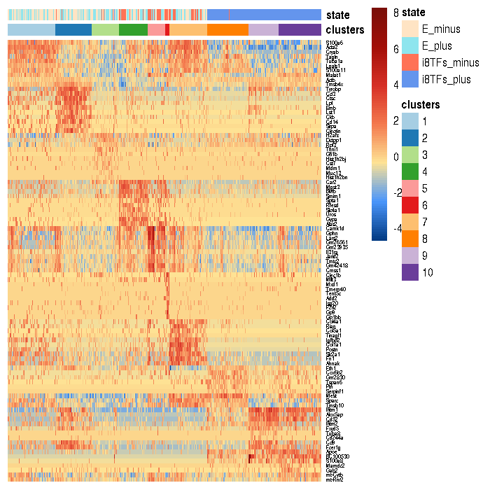

The second heatmap (Figure 10) below also shows the order of genes and clusters by similarity but for normalized expression data. As you can see, genes expressed at a level of seven and nine look very similar. It is hard to highlight all the 
differences in expression of both lowly and highly detected genes in one heatmap using normalized data. For this reason, mean-centering helps to solve this issue.
\newline
```{r plotCellHeatmap_marker2, warning=FALSE, fig.keep = 'none'}
orderClusters <- T # F will apply hierarchical clustering to all cells
orderGenes <- T    # F will apply hierarchical clustering to all genes
meanCentered <- F  # F to show normalized counts
conclus::plotCellHeatmap(markersClusters, sceObjectFiltered, outputDirectory, 
                experimentName, 
                paste0("clusters",
                       length(levels(SummarizedExperiment::colData(sceObjectFiltered)$clusters)),
                       "_meanCentered",meanCentered,
                       "_orderClusters",orderClusters,
                       "_orderGenes",orderGenes,"_top",
                       genesNumber, "markersPerCluster"), 
                meanCentered = meanCentered, 
                colorPalette = RColorBrewer::brewer.pal(10, "Paired"),
                orderClusters = orderClusters,
                orderGenes = orderGenes,
                fontsize_row = 4,
                statePalette = c("bisque", "cadetblue2", 
                                 "coral1", "cornflowerblue"),
                color = colorRampPalette(c("#023b84","#4b97fc", 
                                           "#FEE395", 
                                           "#F4794E", "#D73027",
                                           "#a31008","#7a0f09"))(100),
                returnPlot = TRUE)
```

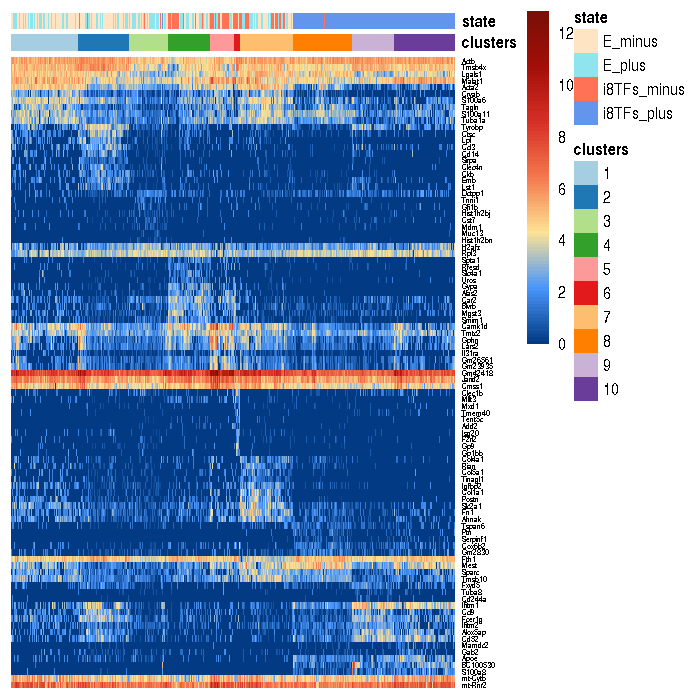

Alternative order of clusters is by name or by hierarchical clustering as in the default pheatmap function.


# Plot t-SNE colored by expression of a selected gene


*PlotGeneExpression* allows visualizing the normalized expression of one gene in a t-SNE plot. It can be useful to inspect the specificity of top markers. Below are examples of marker genes that define a particular cluster (Figures 11-14).
\newline
```{r plotGeneExpression1, eval = FALSE}
# Plot gene expression in a selected tSNE plot
# Ccl3, marker gene for clusters 2
plotGeneExpression("Ccl3", experimentName, outputDirectory, sceObjectFiltered, 
                  tSNEpicture = 10, returnPlot=T)
```

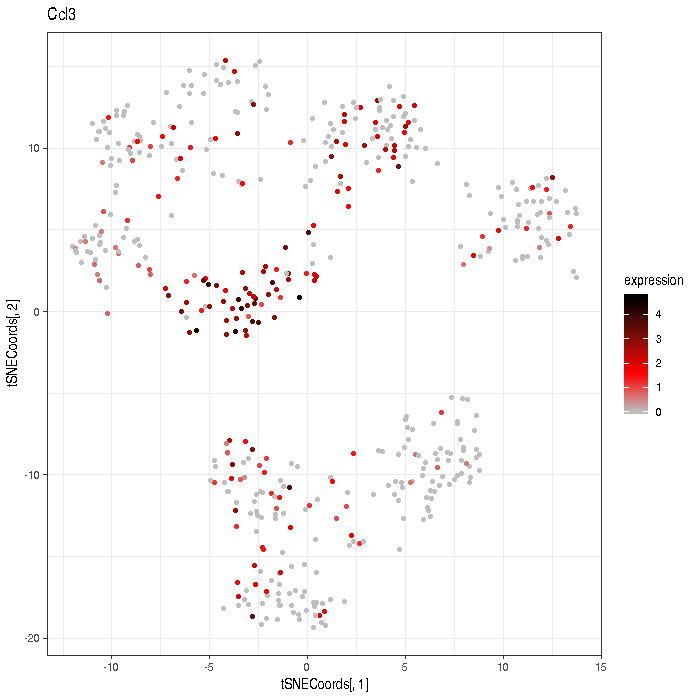

```{r plotGeneExpression2, eval = FALSE}
# Gp9, marker gene for cluster 6
plotGeneExpression("Gp9", experimentName, outputDirectory, sceObjectFiltered, 
                   tSNEpicture = 10, returnPlot=T)
```

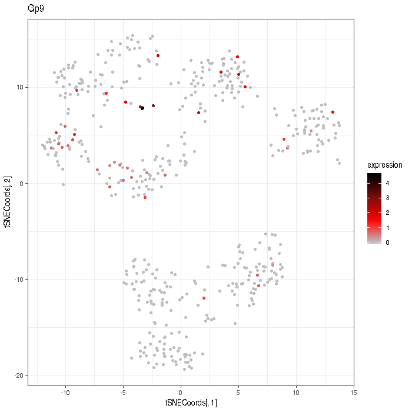

```{r plotGeneExpression3, eval = FALSE}
# Fn1, marker gene for cluster 7
plotGeneExpression("Fn1", experimentName, outputDirectory, sceObjectFiltered, 
                   tSNEpicture = 10, returnPlot=T)
```

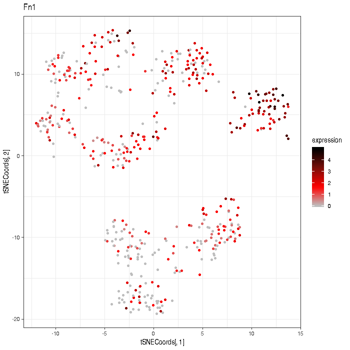

```{r plotGeneExpression4, eval = FALSE}
# Alox5ap, marker gene for cluster 9
plotGeneExpression("Alox5ap", experimentName, outputDirectory, sceObjectFiltered, 
                    tSNEpicture = 10, returnPlot=T)
```

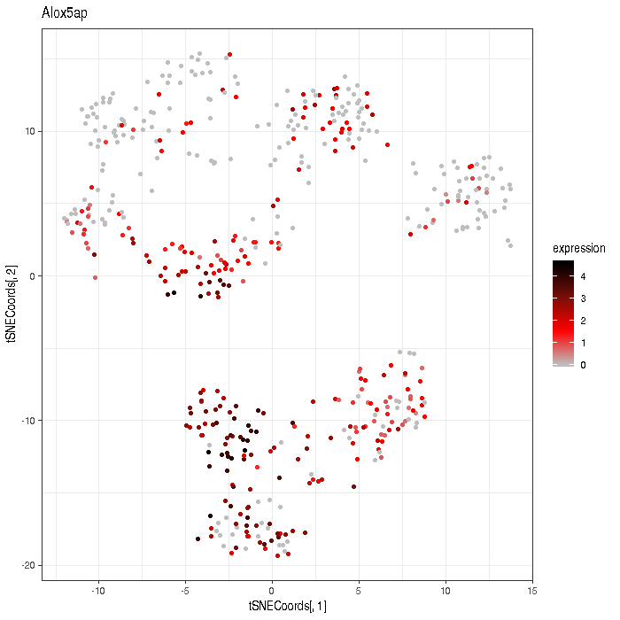

# Collect publicly available info about marker genes

## Collect information for the top 10 markers for each cluster

*GetGenesInfo* is a function for gene information retrieval from open-source databases and websites of NCBI, MGI, and UniProt by web-scraping. It requires markersClusters data frame where the first column “geneName” is mandatory 
and the second column “clusters” is optional. It can have more than two columns; they will be kept in the output file. *GetGenesInfo* can recognize Gene Symbols and Ensembl IDs, genes from both annotations can be present simultaneously.
The second argument is “databaseDir” which is a path to the “Mmus_gene_database_secretedMol.tsv” database contained in the package. Databases for other organisms than mouse will be provided in the future or on request.
\newline
```{r getGenesInfo, eval = FALSE}
result <- getGenesInfo(markersClusters, groupBy = "clusters",
                       getUniprot = TRUE)

outputDir <- file.path(outputDirectory, "/marker_genes/getGenesInfo")
dir.create(outputDir, showWarnings=F)
write.table(result, file = file.path(outputDir, 
                      "Bergiers_markersClusters_top10_clusters9_genesInfo.csv"),
            quote = FALSE, sep = ";", row.names = FALSE)
```

*result* contains the following columns:

  - geneName: official gene symbol or ENSEMBL ID.
  - clusters: The cluster to which the gene is associated.
  - Name: The complete gene name.
  - Feature.Type: protein coding gene, lincRNA gene, miRNA gene, unclassified non-coding RNA gene,
                 or pseudogene.
  - go_id: Gene Ontology (GO) identification number.
  - name_1006: Whether or not a gene belongs to GO terms containing proteins on the cell surface or 
               involved in secretion.
  - MGI: Knockout information from MGI.
  - NCBI: A summary from NCBI.
  - chromosome_name: The chromosome on which the gene is located
  - Symbol: Official gene symbol
  - Ensembl: Ensembl ID
  - MGI.Gene.Marker.ID: MGI ID
  - Entrez.Gene.ID: Entrez ID
  - Uniprot.ID: Uniprot ID
  

## Collect information for the top X markers for each cluster

*MarkersClusters* usually contains 10-20 top marker genes per clusters. However, it is more reliable to use at least 100 genes for cell state annotation. 

The function saveMarkersLists will create a data frames with top 100 marker genes for each cluster (by default). The first column of the output table is the gene name and the second column is the associated cluster. 
It will create “marker_genes/markers_lists” folder and save one table per cluster. 
\newline
```{r saveMarkersLists, eval = FALSE}
saveMarkersLists(experimentName, outputDirectory)
```

The *saveGenesInfo* function will save results of getGenesInfo into "outputDirectory/marker_genes/saveGenesInfo" for each file in “marker_genes/markers_lists”. It goes file by file sequentially. If you see an error message that the 
connection to the website takes too much time, restart the saveGenesInfo from the table where it failed using the startFromFile option. As an example, we will specify “startFromFile = 10” to calculate the output only for the last 
cluster. Hence, we reduce the computational time and the number of output messages. For your analysis, please select “startFromFile = 1”.
 
```{r saveGenesInfo, eval = FALSE}
saveGenesInfo(outputDirectory, sep = ";", header = TRUE, 
              startFromFile = 10, getUniprot = TRUE)
```


# Supervised clustering 

Until now, we have been using CONCLUS in an unsupervised fashion. This is a good way to start the analysis of a sc-RNA-seq dataset. However, the knowledge of the biologist remains a crucial asset to get the maximum of the data. 
This is why we have included in CONCLUS, additional options to do supervised analysis (or “manual” clustering) to allow the researcher to use her/his biological knowledge in the CONCLUS workflow. Going back to the example of the 
Bergiers et al. dataset above (cluster similarity heatmap), one can see that some clusters clearly belong to the same family of cells after examining the clusters_similarity matrix generated by CONCLUS.

It is mostly obvious for clusters 9 and 10. In order to figure out what marker genes are defining these families of clusters, one can use manual clustering in CONCLUS to fuse clusters of similar 
nature: i.e. combine clusters 9 and 10 together.
\newline
```{r merging_clusters}
exportClusteringResults(sceObjectFiltered, outputDirectory, experimentName, 
                        "clusters_table.tsv")
clustersTable <- read.delim(file.path(outputDirectory, "output_tables", 
       paste0(experimentName, "_clusters_table.tsv")), stringsAsFactors = FALSE) 

#replace “10” by “9” in the clusters_table to merge 9/10
clustersTable$clusters[clustersTable$clusters == "10"] = "9"

write.table(clustersTable, file.path(outputDirectory, "output_tables", 
            paste0(experimentName, "_clusters_table_manual.tsv")), 
            quote = FALSE, sep = "\t")
```

Now we can use runCONCLUS again and overwrite old marker genes and save new heatmaps. If you want to keep an old folder with marker genes, please rename it, so runCONCLUS will create a new marker_genes folder.
\newline
```{r addClusteringManually_runCONCLUS, results = "hide", message = FALSE, warning = FALSE, fig.keep = 'none'}
#Correcting clustering manually
sceObjectFiltered <- addClusteringManually(fileName = "clusters_table_manual.tsv", 
    dataDirectory = outputDirectory, 
    experimentName = experimentName,
    sceObject = sceObjectFiltered, 
    columnName = "clusters")

# Redo the analysis with manual clustering
sceObjectFiltered <- runCONCLUS(outputDirectory, experimentName, 
           statePalette= c("bisque", "cadetblue2", "coral1", "cornflowerblue"),
		   preClustered = TRUE, manualClusteringObject = sceObjectFiltered)  
```

As previously, we can now make heatmaps of marker gene expression (Figure 15). 
\newline
```{r plotCellHeatmap_manualClustering, warning = FALSE, fig.keep = 'none'}
# Plotting heatmap displaying mean-centered values
meanCentered <- T  # F to show normalized counts, 
plotCellHeatmap(markersClusters, sceObjectFiltered, outputDirectory, 
                experimentName, 
                paste0("clusters",
                       length(levels(
                     SummarizedExperiment::colData(sceObjectFiltered)$clusters)),
                    "_meanCentered",meanCentered,"_orderClusters",orderClusters,
                       "_orderGenes",orderGenes,"_top",
                       genesNumber, "markersPerCluster"), 
                meanCentered = meanCentered, 
                colorPalette = c("#A6CEE3", "#1F78B4", "#B2DF8A", "#33A02C",
                 "#FB9A99", "#E31A1C", "#FDBF6F", "#FF7F00", "#CAB2D6"),
                orderClusters = orderClusters,
                orderGenes = orderGenes,
                fontsize_row = 5,
                statePalette = c("bisque", "cadetblue2", 
                                 "coral1", "cornflowerblue"),
                color = colorRampPalette(c("#023b84","#4b97fc", 
                                           "#FEE395", 
                                           "#F4794E", "#D73027",
                                           "#a31008","#7a0f09"))(100),
                returnPlot = TRUE)
```

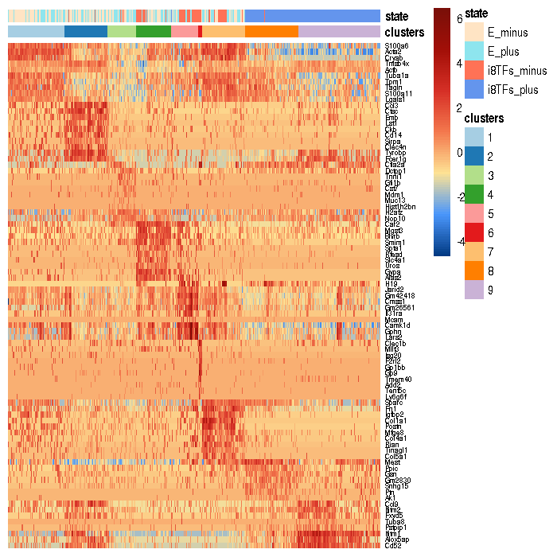

This heatmap shows that Cd52 and Alox5ap are good markers of cluster 9 (mix of old clusters 9 and 10). We can visualize them in the t-SNE plots below.
\newline
```{r, eval = FALSE}
# Plot gene expression in a selected tSNE plot
# Cd52, marker gene for clusters 9 (mix of old clusters 9 and 10)
plotGeneExpression("Cd52", experimentName, outputDirectory, sceObjectFiltered,
                   tSNEpicture = 10, returnPlot = TRUE)
```

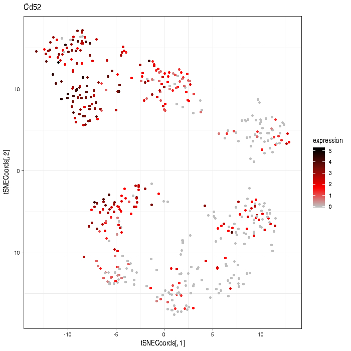

```{r, eval = FALSE}
# Alox5ap, marker gene for cluster 9 (mix of old clusters 9 and 10)
plotGeneExpression("Alox5ap", experimentName, outputDirectory, sceObjectFiltered,
                   tSNEpicture = 10, returnPlot = TRUE)
```

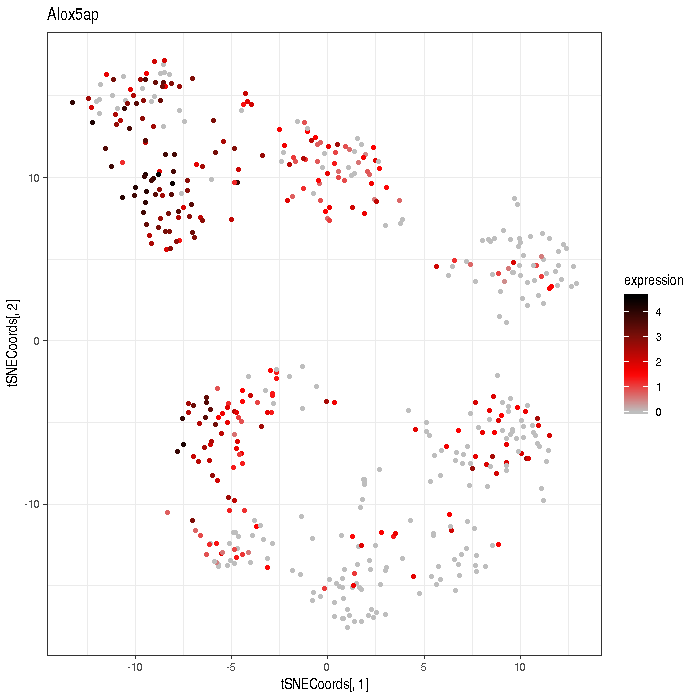


# Conclusion

  Here we demonstrated how to use CONCLUS and combine multiple parameters testing for sc-RNA-seq analysis. It allowed us to gain more information on the dataset of Bergiers et al and will help gaining deeper insights in others. 
  
  Indeed in the original analysis using PCA, two major clusters were found (one composed of i8TFs_plus cells and another comprising E_minus, E_plus, i8TFs_minus cells). Using CONCLUS, we see that there is still a big 
difference between the i8TFs_plus experimental group and the other three. Interestingly, CONCLUS was able to unveil heterogeneity within the i8TFs group while the previous analysis performed by Bergiers et al was not able to reveal it. 
This analysis offers additional information on the function of these eight transcription factors. 


# Session info
This section lists all the packages used for the CONCLUS tool.
```{r}
sessionInfo()
```
